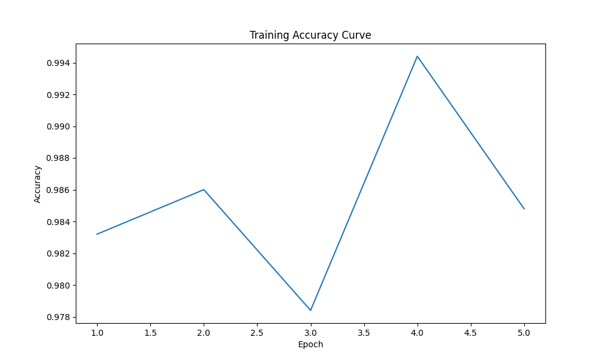

# 显微病理图像识别系统（ViT+OpenVINO）

### 项目简介
基于深度学习构建的**肺与结肠组织病理图像智能分类系统**，支持**肺腺癌、肺鳞状细胞癌、结肠腺癌、正常肺组织、正常结肠组织**5类病理图像识别，助力病理诊断效率提升。

### 核心价值
- **小样本适配**：针对病理数据稀缺痛点，内置数据增强与迁移学习策略
- **高分辨率优化**：支持 768×768 像素病理图像高效处理
- **全流程覆盖**：打通「数据预处理→模型训练→推理部署」完整链路

### 技术架构

| 环节     | 核心工具/框架 | 解决的问题                 |
|----------|---------------|----------------------------|
| 数据处理 | OpenCV、Python| 病理图像标准化、数据集划分 |
| 模型训练 | PyTorch、ResNet| 特征提取与病理类别分类     |
| 推理部署 | Flask、ONNX   | 网页端演示与工业级部署     |

### 🚀 快速开始

### 1. 环境准备
```bash
# 建议使用 Conda 创建虚拟环境
conda create -n patho_env python=3.8
conda activate patho_env

# 安装依赖
pip install torch torchvision opencv-python scikit-learn flask onnx
```

### 2. 数据准备
将病理图像按类别整理到如下目录结构：
```
data/
├── colon_aca/      # 结肠腺癌
├── colon_n/        # 正常结肠组织
├── lung_aca/       # 肺腺癌
├── lung_n/         # 正常肺组织
└── lung_scc/       # 肺鳞状细胞癌
```

### 3. 模型训练
```bash
python train.py --data_dir data/ --epochs 10 --batch_size 16
```
训练完成后，模型将保存至 `models/best_model.pth`，训练日志与指标曲线在 `results/` 目录。


### 4. 批量评估
```bash
python eval.py --model_path models/best_model.pth --data_dir data/
```
输出包含准确率、精确率、召回率等指标，保存在 `results/`。


### 📊 效果展示

#### 训练与验证曲线
| 训练准确率 | 验证准确率 |
|------------|------------|
| | |
| 最高准确率：98.5% | 最高准确率：96.2% |
| 训练损失 | 验证损失 |
| | |
| 最低损失：0.05 | 最低损失：0.12 |


### 🛠️ 模型导出与部署
将 PyTorch 模型转为 ONNX 格式，支持跨平台部署：
```bash
python export_onnx.py --model_path models/best_model.pth --output_path models/model.onnx
```

### 📄 许可证
本项目基于 MIT 许可证开源，详情见 [LICENSE](LICENSE) 文件。

